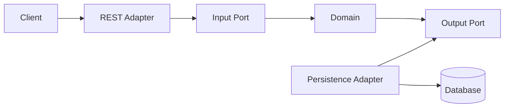

# Software Architecture

## 1. Introduction

This document describes the target software architecture for **NexusMarket**, a centralized marketplace that acts as a commercial intermediary between buyers and sellers.

The architecture supports the business capabilities identified in the official functional specification: user and participant management, seller and warehouse administration, product catalog, distributed inventory, shopping cart, orders, billing, shipments, returns, refunds, and administrative queries.

The functional specification is the primary source of business requirements. The reference banking repository is used only as a guide for documentation structure. Architectural choices such as Hexagonal Architecture, Domain-Driven Design, Java, Spring Boot, Maven, MySQL, and MongoDB are technical decisions for the NexusMarket project; they are not additional functional requirements.

---

## 2. Architecture Status

This document defines the **target architecture** of NexusMarket.

At the current stage, the project contains the Spring Boot entry point and the initial domain folders. The remaining packages, ports, adapters, services, controllers, and persistence components will be created progressively as the domain model and use cases are implemented.

Therefore, the structures described here represent the intended design and must not be interpreted as fully implemented components.

---

## 3. Architectural Style

NexusMarket will use **Hexagonal Architecture**, also known as **Ports and Adapters Architecture**, supported by Domain-Driven Design and SOLID principles.

The central idea is that the business domain must remain independent from technical details such as:

- Spring Boot.
- REST and HTTP.
- MySQL.
- MongoDB.
- JPA or Spring Data.
- JSON serialization.
- Authentication mechanisms.
- External services.

The domain exposes ports that define what the application can do and what external capabilities it requires. Adapters connect those ports to concrete technologies.

### 3.1 Architectural Objectives

- Keep business rules at the center of the system.
- Separate business logic from framework and infrastructure code.
- Allow persistence technologies to change without changing the domain model.
- Facilitate isolated unit testing of business behavior.
- Reduce coupling between modules.
- Improve maintainability and evolution of the application.
- Make technical decisions explicit and replaceable.
- Preserve traceability between requirements, domain rules, use cases, and implementation.

### 3.2 Dependency Rule

Dependencies must point toward the domain.

The domain may be used by application services and adapters, but the domain must not depend on controllers, databases, frameworks, or other infrastructure components.



The persistence adapter implements an output port defined closer to the domain. The domain never calls a database technology directly.

---

## 4. Design Principles

### 4.1 Domain First

The implementation begins with the business language, entities, Value Objects, invariants, and use cases defined for NexusMarket.

Framework annotations and persistence mappings must not determine the shape of the domain model.

### 4.2 Separation of Concerns

Each layer has a specific responsibility:

- The domain represents business concepts and rules.
- Input ports define operations offered by the application.
- Output ports define capabilities required by the domain or application.
- Input adapters translate external requests into application calls.
- Output adapters connect the application to databases or external systems.
- Infrastructure configures frameworks, security, databases, and dependency wiring.

### 4.3 Dependency Inversion

High-level business policies must not depend on low-level technical implementations. Both interact through abstractions represented by ports.

### 4.4 High Cohesion and Low Coupling

Related responsibilities must remain together, while dependencies between unrelated components must be minimized.

### 4.5 Explicit Business Rules

Rules such as preventing negative inventory, restricting operations by role, and prohibiting changes to finalized orders must be enforced in the domain or application layer, not only in controllers or database constraints.

### 4.6 Technology Independence

The domain must use plain Java whenever possible. It must not contain Spring, HTTP, SQL, MongoDB, or presentation-specific classes.

---

## 5. Proposed Project Structure

The target package structure is the following:

```text
NEXUSMARKET/
└── src/
    ├── main/
    │   ├── java/
    │   │   └── application/
    │   │       ├── NexusmarketApplication.java
    │   │       ├── domain/
    │   │       │   ├── models/
    │   │       │   ├── valueobjects/
    │   │       │   ├── services/
    │   │       │   ├── exceptions/
    │   │       │   └── ports/
    │   │       │       ├── in/
    │   │       │       └── out/
    │   │       ├── adapters/
    │   │       │   ├── in/
    │   │       │   │   └── rest/
    │   │       │   │       ├── controllers/
    │   │       │   │       ├── requests/
    │   │       │   │       ├── responses/
    │   │       │   │       └── mappers/
    │   │       │   └── out/
    │   │       │       └── persistence/
    │   │       │           ├── mysql/
    │   │       │           │   ├── adapters/
    │   │       │           │   ├── entities/
    │   │       │           │   ├── repositories/
    │   │       │           │   └── mappers/
    │   │       │           └── mongodb/
    │   │       │               ├── adapters/
    │   │       │               ├── documents/
    │   │       │               ├── repositories/
    │   │       │               └── mappers/
    │   │       └── infrastructure/
    │   │           ├── config/
    │   │           ├── database/
    │   │           └── security/
    │   └── resources/
    └── test/
        └── java/
            └── application/
```

Package names are written in lowercase according to Java conventions. Existing folders `domain/models` and `domain/valueobjects` are valid starting points for this structure.

---

## 6. Architectural Components

## 6.1 Domain Layer

The domain layer contains the business model and the rules that must remain valid regardless of the interface or persistence technology.

### Responsibilities

- Represent business entities and their lifecycle.
- Represent Value Objects and controlled business concepts.
- Protect entity and aggregate invariants.
- Implement domain behavior.
- Define domain services when behavior does not naturally belong to one entity.
- Define domain-specific exceptions.
- Declare input and output ports.

### Restrictions

The domain layer must not:

- Import Spring annotations.
- Import JPA or MongoDB annotations.
- Know controllers, DTOs, HTTP status codes, or JSON.
- Execute SQL queries.
- Access repositories implemented with a specific technology.
- Contain configuration classes.

### Main Domain Packages

| Package | Responsibility |
| --- | --- |
| `domain.models` | Entities, aggregates, and business concepts with identity. |
| `domain.valueobjects` | Immutable concepts defined by value and controlled domain types. |
| `domain.services` | Business operations that do not belong naturally to a single entity. |
| `domain.exceptions` | Errors expressed in business language. |
| `domain.ports.in` | Use cases exposed by the application. |
| `domain.ports.out` | Capabilities required from persistence or external systems. |

### Initial Domain Concepts

The domain model currently identifies the following principal concepts:

- User.
- Buyer.
- Seller.
- Warehouse.
- Product.
- Inventory.
- Cart.
- Order.
- Invoice.
- Shipment.
- Return.
- Refund.

Supporting concepts include Product Variant, Inventory Movement, Cart Item, Order Item, and Administrative Report.

Their final implementation as entities, aggregate members, Value Objects, services, or projections must follow the validated Domain Model.

---

## 6.2 Input Ports

Input ports define the use cases that NexusMarket offers to its actors. They describe application capabilities without exposing REST, controllers, or database details.

Possible input ports include:

- Register buyer.
- Register seller.
- Manage seller status.
- Register warehouse.
- Register and publish product.
- Manage distributed inventory.
- Add product to cart.
- Confirm order.
- Register payment result.
- Dispatch order.
- Confirm delivery.
- Request return.
- Process refund.
- Consult administrative reports.

These names are initial candidates. The final interfaces and operations must be created from validated use cases, not merely from this list.

### Rules

- Each input port represents a business intention.
- Input ports must not expose framework classes.
- A use case coordinates domain objects and output ports.
- Controllers call input ports; they do not replace them.

---

## 6.3 Output Ports

Output ports define services that the application needs from the outside world.

Typical output ports may include:

- User repository.
- Seller repository.
- Warehouse repository.
- Product repository.
- Inventory repository.
- Cart repository.
- Order repository.
- Invoice repository.
- Shipment repository.
- Return repository.
- Refund repository.
- Audit or traceability repository.

The exact repository boundaries will be decided after aggregate boundaries are validated. It is not necessary to create one repository for every class.

### Rules

- Output ports define domain-oriented operations.
- They must not return JPA entities or MongoDB documents.
- They must not expose SQL, database drivers, or framework-specific pagination classes to the domain.
- Concrete adapters implement these ports.

---

## 6.4 Input Adapters

Input adapters receive requests from external actors and translate them into calls to input ports.

The first planned input adapter is a REST API.

### REST Adapter Responsibilities

- Receive HTTP requests.
- Validate request structure and required input format.
- Convert request DTOs into domain or use-case input data.
- Invoke the corresponding input port.
- Convert application results into response DTOs.
- Translate known exceptions into appropriate HTTP responses.

### REST Adapter Restrictions

- Controllers must not contain business rules.
- Controllers must not access database repositories directly.
- Request and response DTOs must not become domain entities.
- HTTP status codes must not appear in the domain layer.
- Mapping logic must be separated when it becomes nontrivial.

---

## 6.5 Output Adapters

Output adapters implement the output ports and translate domain objects into technical persistence representations.

### MySQL Adapter

The MySQL adapter is intended for transactional and relational information whose consistency and relationships are central to the commercial process.

Possible candidates include:

- Users and participant profiles.
- Sellers and warehouses.
- Products and variants.
- Inventory balances.
- Carts and orders.
- Invoices, shipments, returns, and refunds.

This is an initial technical direction. The definitive persistence mapping must be documented after aggregate boundaries and transaction requirements are validated.

### MongoDB Adapter

MongoDB is intended for document-oriented information such as audit, traceability, event history, or operational records when a flexible document structure is useful.

Possible candidates include:

- Inventory movement history.
- Order state traceability.
- Operational audit records.
- Administrative query projections.

Using MongoDB for these concepts is a technical decision still subject to validation. Business entities must not depend on MongoDB documents.

### Persistence Mapping Rule

Domain objects and persistence objects are different responsibilities:

- `domain.models` contains business objects.
- `mysql.entities` contains relational persistence entities.
- `mongodb.documents` contains document persistence models.
- Persistence mappers convert between these representations.

This separation prevents JPA or MongoDB annotations from contaminating the domain model.

---

## 6.6 Infrastructure Layer

The infrastructure layer contains configuration and framework integration needed to run the application.

### Responsibilities

- Spring bean configuration.
- Dependency injection and adapter wiring.
- Database connection configuration.
- Persistence framework configuration.
- Security configuration.
- Cross-cutting technical configuration.

### Restrictions

- Infrastructure must not define business rules.
- Infrastructure must not become a container for domain behavior.
- Technical configuration must remain replaceable.

---

## 7. Business Capability Areas

The architecture groups the NexusMarket domain into the following business capability areas. These are logical divisions and do not yet imply independently deployed microservices.

| Capability Area | Main Responsibilities |
| --- | --- |
| Identity and Participants | Users, roles, buyers, sellers, administrators, supervisors, and logistics operators. |
| Catalog | Products, variants, publication, suspension, discontinuation, and product types. |
| Warehouses and Inventory | Warehouses, distributed stock, reservations, adjustments, movements, and inventory conditions. |
| Shopping | Carts, cart items, selection of products, quantities, and preliminary totals. |
| Orders | Order creation, state transitions, order items, immutability after finalization, and coordination of the purchase flow. |
| Billing | Invoice generation and commercial billing information. |
| Logistics | Dispatch, shipment tracking, delivery, and warehouse operations. |
| Post-sale | Returns, product reception, inventory restoration when applicable, and refunds. |
| Reporting | Administrative and supervisory queries without unauthorized modification of operational information. |

These areas may later become modules or bounded contexts if the size and complexity of the implementation require it.

---

## 8. Main Interaction Flow

A normal request follows this direction:

1. An external actor sends an HTTP request.
2. A REST controller receives and validates the request format.
3. The controller invokes an input port.
4. The use case coordinates entities, Value Objects, and domain services.
5. The use case requests persistence through an output port when necessary.
6. A persistence adapter implements that output port.
7. The adapter maps the domain object to a persistence entity or document.
8. The database operation is executed.
9. The result returns through the same boundaries without exposing persistence objects to the domain or client.

```mermaid
sequenceDiagram
    actor Actor
    participant Controller as REST Controller
    participant UseCase as Input Port / Use Case
    participant Domain as Domain Model
    participant Repository as Output Port
    participant Adapter as Persistence Adapter

    Actor->>Controller: HTTP request
    Controller->>UseCase: Application command
    UseCase->>Domain: Execute business behavior
    UseCase->>Repository: Save or retrieve
    Adapter-->>Repository: Port implementation
    Adapter-->>UseCase: Domain result
    UseCase-->>Controller: Use-case result
    Controller-->>Actor: HTTP response
```

---

## 9. Technology Stack

| Technology | Intended Responsibility | Decision Type |
| --- | --- | --- |
| Java 17 | Main implementation language. | Technical project decision |
| Spring Boot | Application startup, dependency injection, web and infrastructure integration. | Technical project decision |
| Maven | Dependency management, build, and test execution. | Technical project decision |
| MySQL | Relational and transactional persistence. | Technical project decision |
| MongoDB | Document-oriented audit, traceability, or projections. | Technical project decision under validation |
| REST/HTTP | Initial external application interface. | Technical project decision |

The versions of Spring Boot and its dependencies are controlled by `pom.xml`. A library must not be introduced only because it appears in the reference repository.

---

## 10. Persistence Strategy

The functional specification does not prescribe a database technology. Consequently, the database selection and data distribution are architectural decisions.

### 10.1 Polyglot Persistence

NexusMarket plans to use MySQL and MongoDB according to the nature of the information rather than duplicating every record in both databases.

- MySQL is preferred for transactional operations and relational integrity.
- MongoDB is considered for traceability, audit, history, or read-oriented documents.
- A concept must have a clearly defined source of truth.
- Cross-database consistency must be designed before a use case writes to both technologies.
- No business rule may rely only on eventual consistency when immediate consistency is required.

### 10.2 Repository Boundaries

Repositories must be defined around aggregate and use-case needs. Repository design must avoid:

- One repository automatically created for every class.
- Exposing database entities outside persistence adapters.
- Generic CRUD operations that bypass business behavior.
- Database-specific query types inside the domain.

### 10.3 Transactions

Transactional boundaries must follow complete business operations. Examples requiring analysis include:

- Reserving inventory when an order is confirmed.
- Recording payment and changing the order status.
- Dispatching an order and updating related stock movements.
- Accepting a return and restoring eligible inventory.
- Registering a refund after an approved return.

The exact transaction mechanism will be documented when these use cases are designed.

---

## 11. Security and Authorization

The functional specification establishes that operations must be executed by authenticated users and that each participant may only access information permitted by their role.

The technical authentication mechanism is not defined by the functional specification. Therefore, JWT, sessions, OAuth, password storage, and identity-provider integration remain pending technical decisions.

### Architectural Rules

- Authentication belongs to the infrastructure and input boundary.
- Authorization must be enforced for every protected use case.
- Role restrictions must not depend exclusively on the frontend.
- The authenticated identity must be propagated to the application use case without coupling the domain to Spring Security.
- Sensitive credentials must never be stored in domain documentation or source code.
- A user has exactly one system role according to the current specification.

The implemented system roles are:

- `BUYER`.
- `SELLER`.
- `LOGISTICS_OPERATOR`.
- `ADMINISTRATOR`.
- `SUPERVISOR`.

---

## 12. Error Handling

Errors must be expressed at the correct boundary.

### Domain Errors

The domain may report business violations such as:

- Insufficient inventory.
- Attempt to reserve nonexistent or damaged inventory.
- Invalid order state transition.
- Modification of a finalized order.
- Operation not permitted for the participant.
- Invalid product publication state.
- Invalid quantity or monetary value.

### Adapter Errors

Input adapters translate known application and domain errors into external responses. For REST, this may include HTTP status codes and structured error bodies.

Infrastructure errors such as database unavailability must be translated without leaking drivers, SQL statements, stack traces, or sensitive technical details to the client.

---

## 13. Validation Strategy

Validation is distributed according to responsibility:

| Validation Type | Location |
| --- | --- |
| Request syntax, required JSON fields, and basic format | REST request DTO and input adapter |
| Business invariants | Entity, Value Object, aggregate, or domain service |
| Use-case permissions and orchestration rules | Application use case |
| Referential and storage constraints | Persistence adapter and database, as secondary protection |

Database constraints complement business validation but do not replace it.

---

## 14. Testing Strategy

### 14.1 Domain Unit Tests

Domain tests must run without Spring and without a database. They verify:

- Entity behavior.
- Value Object validation.
- Business invariants.
- State transitions.
- Calculations.
- Domain services.

### 14.2 Use-Case Tests

Use-case tests use fake or mocked output ports to verify coordination, permissions, and expected interactions.

### 14.3 Adapter Integration Tests

Integration tests verify:

- MySQL mappings and repositories.
- MongoDB documents and repositories.
- Port implementations.
- Transaction behavior.
- Mapping between persistence and domain objects.

### 14.4 REST Tests

REST tests verify:

- Endpoint contracts.
- Request validation.
- Response mapping.
- Authentication and authorization behavior.
- Error translation.

---

## 15. Core Architectural Rules

The following rules apply throughout the implementation:

1. Business rules belong to the domain or use-case layer.
2. Domain classes must not import Spring, JPA, MongoDB, HTTP, or JSON classes.
3. Controllers must communicate with input ports, not directly with repositories.
4. Persistence adapters must implement output ports.
5. JPA entities and MongoDB documents must not be returned by input ports.
6. Request and response DTOs must not be used as domain entities.
7. Mapping between layers must be explicit.
8. Package names must use lowercase Java naming conventions.
9. A technology choice must not create a new business requirement.
10. Concepts absent from the functional specification must be marked as inferred or pending confirmation.
11. Aggregate invariants must be protected before persistence.
12. Finalized orders must not be modified.
13. Inventory must never become negative.
14. Nonexistent or damaged inventory must not be reserved.
15. Authorization must be enforced on the backend for every protected operation.

---

## 16. Current Implementation Scope

At the current delivery checkpoint, the repository contains:

- A Maven and Spring Boot project using Java 17.
- A Spring Boot application entry point.
- Implemented domain packages `application.domain.models` and `application.domain.valueobjects`.
- User participant models: `User`, `Buyer`, `Seller`, `LogisticsOperator`, `Administrator`, and `Supervisor`.
- Commercial and logistics models: `Product`, `Warehouse`, `Inventory`, `InventoryMovement`, `Cart`, `Order`, `Invoice`, `Shipment`, `Return`, and `Refund`, including their internal item models.
- Implemented enums and immutable Value Objects for roles, statuses, classifications, movement types, Inventory condition, and Product variants.
- Automated domain unit tests covering business validation, authorization, Inventory, Cart, Order lifecycle, billing, Shipment, Return, and Refund behavior.
- 102 Maven-detected tests at the current checkpoint, with zero failures, zero errors, and one generated application-context test skipped until database configuration is introduced.
- The Domain Model, Domain Value Objects, and Software Architecture documents.

The following items are planned and not yet considered implemented:

- Input and output ports.
- Application use-case services.
- REST controllers, request DTOs, response DTOs, and REST mappers.
- MySQL persistence adapters.
- MongoDB persistence adapters.
- Authentication and authorization infrastructure.
- Database schemas and persistence mappings.
- Adapter integration tests and complete application-context tests.

This distinction prevents the architecture document from overstating the current state of the code.

---

## 17. Pending Architectural Decisions

The following decisions require validation before implementation:

- Final aggregate boundaries.
- Exact input ports and use-case commands.
- Repository boundaries based on aggregates.
- Definitive allocation of information between MySQL and MongoDB.
- Source of truth for inventory movement and order traceability.
- Cross-database consistency strategy.
- Authentication mechanism.
- Authorization implementation.
- API endpoint design and versioning.
- Transaction boundaries.
- Event publication or asynchronous processing needs.
- Exact persistence mappings and identifiers.
- Any future status catalogs for Invoice, Shipment, Return, and Refund.
- Observability, logging, and audit requirements.

Pending decisions must not be silently converted into definitive business rules.

---

## 18. Architecture Evolution

This architecture is designed to evolve incrementally.

The recommended implementation order is:

1. Validate the Domain Model and Domain Value Objects.
2. Define aggregate boundaries and invariants.
3. Define the first business use cases.
4. Create input and output ports for those use cases.
5. Implement domain behavior and use-case services.
6. Add REST input adapters.
7. Add persistence output adapters.
8. Configure security and infrastructure.
9. Add unit and integration tests.
10. Review the architecture after each completed business capability.

The system begins as a modular application. A migration toward independently deployed services should only be considered if concrete scalability, deployment, ownership, or operational requirements justify it.

---

## 19. Conclusion

The NexusMarket architecture places the business domain at the center and isolates it from presentation, persistence, and framework concerns.

Hexagonal Architecture provides clear boundaries through input and output ports. Domain-Driven Design provides the language and modeling principles required to represent users, sellers, products, warehouses, inventory, orders, billing, logistics, returns, and refunds consistently.

This document defines the target technical direction. The official functional specification remains the source of truth for business requirements, while unresolved design decisions remain explicitly marked for later validation.
